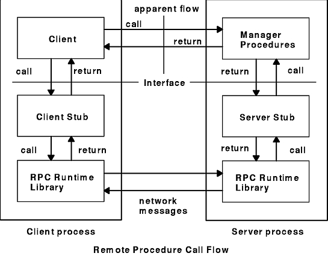
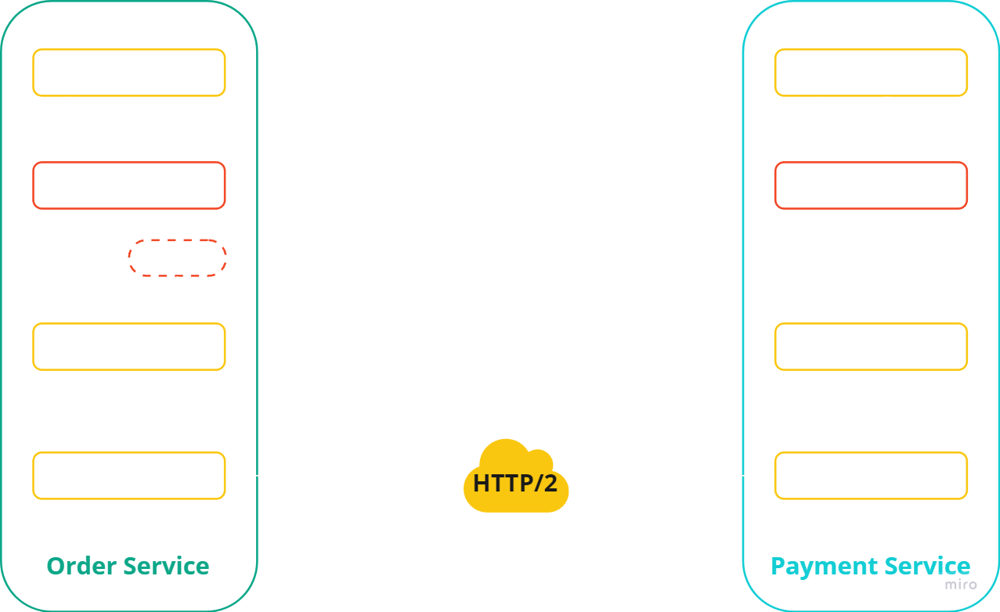
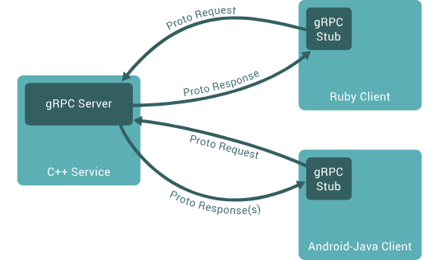
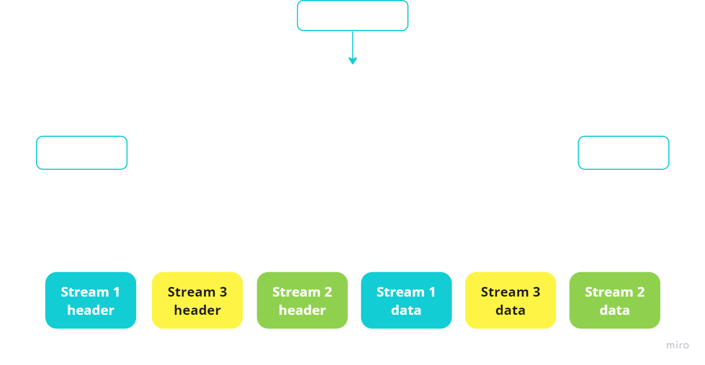
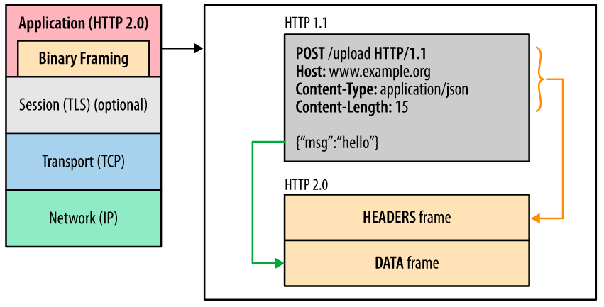
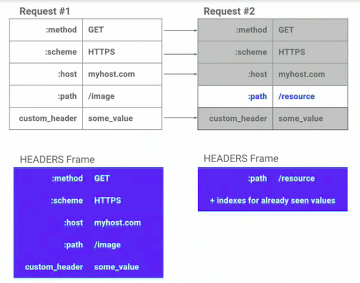
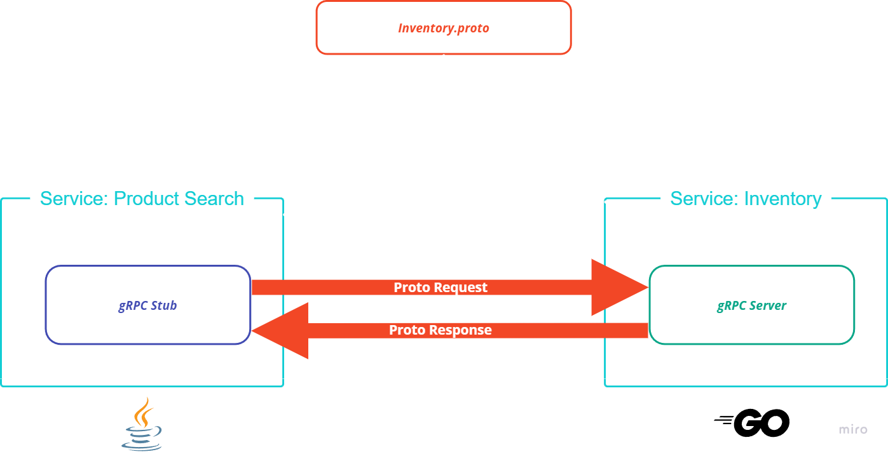
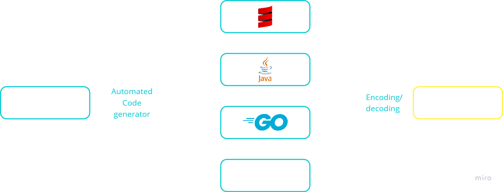

# O que é RPC?

As comunicações cliente-servidor funcionam como se as solicitações da API do cliente fossem uma operação local ou como se a solicitação fosse um código interno do servidor.

Um cliente envia uma solicitação para um processo no servidor que está sempre ouvindo chamadas remotas. Na solicitação, ele contém a função do servidor a ser chamada, junto com todos os parâmetros a serem transmitidos. Uma *API RPC* usa um protocolo como HTTP, TCP ou UDP como o mecanismo subjacente de troca de dados. 

Isso ainda é utilizado – porém, o modelo RPC é mais usado para comunicação de baixo nível, até que o Java implementou uma API chamada JRMI (Java Remote Method Invocation) que funciona basicamente da mesma forma que o *gRPC* funciona hoje em dia, porém de uma maneira mais voltada para métodos e classes e não para comunicação entre processos.



# O que é gRPC

E uma implementacao do RPC e um framework open-source criado pelo google em 2016 e adotado por muitas empresas como o modelo RPC preferido e foi aderido pelo google, netflix, slack, cisco e entre outras no mercado. 

A ideia base do gRPC era ser muito mais performático do que a sua contraparte REST por ser baseado no HTTP/2 e utilizar uma Linguagem de Definição de Interfaces (IDL) conhecida como Protocol Buffers (protobuf). Este conjunto de ferramentas torna possível que o gRPC seja utilizado em diversas linguagens ao mesmo tempo com um overhead muito baixo enquanto continua sendo mais rápido e mais eficiente do que as demais arquiteturas de chamadas de rede.

Além disso, a chamada de um método remoto é, essencialmente, uma chamada comum de um método local, que é interceptada por um modelo local do objeto remoto e transformada em uma chamada de rede, ou seja, você está chamando um método local como se fosse um método remoto.

# Como gRPC funciona

No gRPC, uma aplicação cliente pode chamar diretamente um método em uma aplicação servidor em uma máquina diferente, como se fosse um objeto local, facilitando a criação de aplicações e serviços distribuídos. Como em muitos sistemas RPC, o gRPC é baseado na ideia de definir um serviço, especificando os métodos que podem ser chamados remotamente, juntamente com seus parâmetros e tipos de retorno. No lado do servidor, este implementa a interface e executa um servidor gRPC para lidar com chamadas do cliente. No lado do cliente, o cliente possui um stub que fornece os mesmos métodos que o servidor.


  
Clientes e servidores gRPC podem ser executados e se comunicar em diversos ambientes - desde servidores dentro do Google até o seu próprio desktop - e podem ser escritos em qualquer uma das linguagens suportadas pelo gRPC. Portanto, por exemplo, é possível criar facilmente um servidor gRPC em Java com clientes em Go, Python ou Ruby.



# HTTP/2
O HTTP/2 já é utilizado faz algum tempo e vem se tornando a principal forma de comunicação na web desde 2015.



Entre as muitas vantagens do HTTP/2 (que também foi criado pela Google), está o fato de que ele é muito mais rápido do que o HTTP/1.1 por conta de vários fatores.
### Multiplexação de requests e respostas

Tradicionalmente, o HTTP não pode enviar mais de uma requisição por vez para um servidor, ou então receber mais de uma resposta na mesma conexão, isso torna o HTTP/1.1 mais lento, já que ele precisa criar uma nova conexão para cada requisição.

No HTTP/2 temos o que é chamado de multiplexação, que consiste em poder justamente receber várias respostas e enviar várias chamadas em uma mesma conexão. Isto só é possível por conta da criação de um novo frame no pacote HTTP chamado de **Binary Framing**. Este frame essencialmente separa as duas partes (headers e payload) da mensagem em dois frames separados, porém contidos na mesma mensagem dentro de um encoding específico.



### Compressão de headers

Outro fator que transforma o HTTP/2 em um protocolo mais rápido é a compressão de headers. Em alguns casos os headers de uma chamada HTTP podem ser maiores do que o seu payload, por isso o HTTP/2 tem uma técnica chamada HPack que faz um trabalho bastante interessante.

Inicialmente tudo na chamada é comprimido, inclusive os headers, isso ajuda na performance porque podemos trafegar os dados binários ao invés de texto. Além disso, o HTTP/2 mapeia os headers que vão e vem de cada lado da chamada, dessa forma é possível saber se os headers foram alterados ou se eles estão iguais aos da última chamada.

Se os headers foram alterados, somente os headers alterados são enviados, e os que não foram alterados recebem um índice para o valor anterior do header, evitando que headers sejam enviados repetidamente.



Como você pode ver, somente o `path` dessa requisição mudou, portanto só ele será enviado.

# Protocol Buffers

Os protocol buffers (ou só **protobuf**), são um método de serialização e desserialização de dados que funciona através de uma linguagem de definição de interfaces (IDL).

Foi criado pela Google em 2008 para facilitar a comunicação entre microsserviços diversos. A grande vantagem do protobuf é que ele é agnóstico de plataforma, então você poderia escrever a especificação em uma linguagem neutra (o próprio `proto`) e compilar esse contrato para vários outros serviços, dessa forma a Google conseguiu unificar o desenvolvimento de diversos microsserviços utilizando uma linguagem única de contratos entre seus serviços.

Cada método (ou RPC) de um serviço só pode receber um único parâmetro de entrada e um de saída, por isso é importante podermos compor as mensagens de forma que elas formem um único componente.

Além disso, toda mensagem serializada com o protobuf é enviada em formato binário, de forma que a sua velocidade de transmissão para seu receptor é muito mais alta do que o texto puro, já que o binário ocupa menos banda e, como o dado é comprimido pelo HTTP/2, o uso de CPU também é muito menor.

```protobuf
service Publisher {
	rpc SignBook (SignRequest) return (SignReply) {}
}

message SignRequest {
	string name = 1;
}

message SignReply {
	string signature = 1;
}
```






# Benefícios

- Mais leve e mais rápido por utilizar codificação binária e HTTP/2

- Multi plataforma com a mesma interface de contratos

- Funciona em muitas plataformas com pouco ou nenhum overhead

- O código é auto documentado

- Implementação relativamente fácil depois do desenvolvimento inicial

# Problemas

- Protobuf nao possui um package manager para gerenciar dependencias entre arquivos e interface

- Exige uma pequena mudança de paradigma em relação ao modelo REST

- Curva de aprendizado inicial é mais complexa

- Não é uma especificação conhecida por muitos

- Por conta de não ser muito conhecido, a documentação é esparsa

- A arquitetura de um sistema usando gRPC pode se tornar um pouco mais complexa

### Referências:
1. https://blog.lsantos.dev/guia-grpc-1/
2. https://aws.amazon.com/pt/compare/the-difference-between-grpc-and-rest/
3. https://grpc.io/docs/what-is-grpc/
4. https://www.youtube.com/watch?v=gnchfOojMk4
5. https://www.ibm.com/docs/en/aix/7.1?topic=concepts-remote-procedure-call